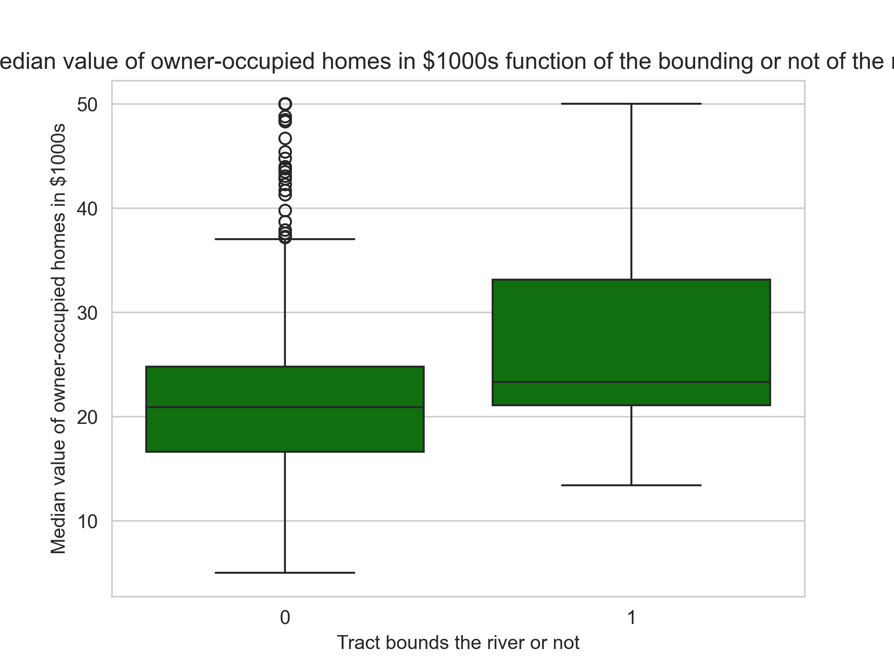
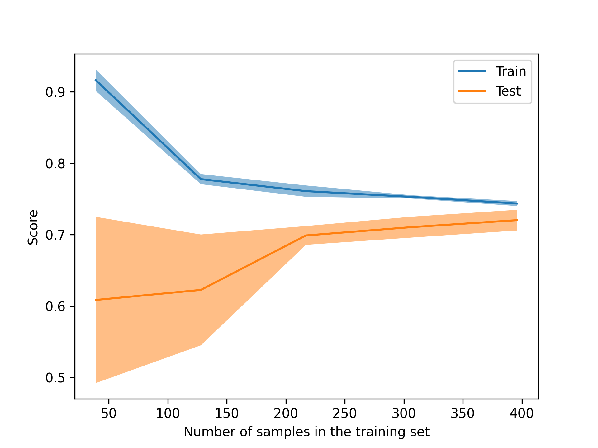

Author : Arnaud TECHER

This Boston House Pricing project is a learning project aiming to improve competences in Machine Learning and Python Porgramming.
The goal is to apply machine learning algorithm in order to estimate the price of a new house given an ensemble of features of the house.
A Kaggle dataset is leverage in this project in order to apply several methods of data visualisation, data analyze and machine learning algorithm. 

The main concept apply in this project are : 
    - POO programming in python 
    - Data analyze - visualisation using Pandas, Matplotlib, Seaborn
    - Machine Learning using Scikit-learn

The machine learning algorithms used are : LinearRegression, GradientBoostingRegressor and RandomForestRegressor.
Data engineering were use in order to load the dataset and prepare it for learning and testing. 
Several metrics were used to compare the difference between these methods and some visualisation were used to show the learning process of the algorithms. 

Here is an example of plots done during the exploration of the data using Seaborn : 

  

Hereafter, you will find and exemple of learning curve of a Linear regression model on the dataset.

  

Comparison of the machine learning model used on the Boston House Pricing Dataset : 

| MODELS       | Linear Regression                | Gradient Boosting Regression      | Random Forest Regression         |
|--------------|----------------------------------|-----------------------------------|----------------------------------|
| Time (ms)    | 1.17                             | 269                               | 131                              |
| MSE          | 6.96                             | 7.90                              | 4.99                             |
| Abs MSE      | 2.03                             | 2.33                              | 1.84                             |
| R2 Coeff     | 0.600.60                         | 0.55                              | 0.71                             |
| Accuracy (%) | 88.32                            | 88.84                             | 91.49                            |

